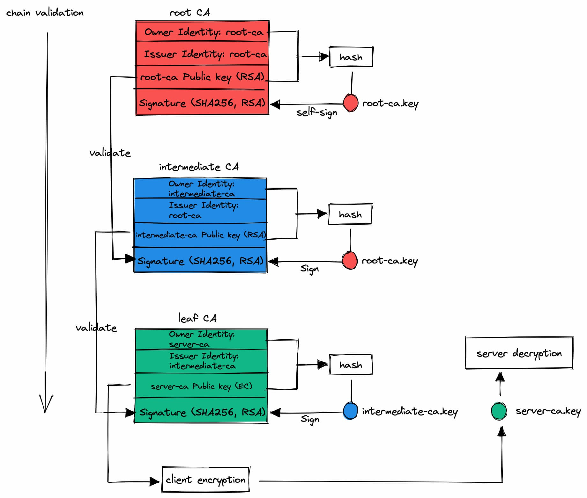

== problem

understand how PKI works and the typical use cases

== concepts

PKI:  public key infrastructure +
PKCS: public key cryptography standard standard for signing or encrypting data +
X.509 certificate: certificate binds an identity to a publick key using a digital signature. international telecommunication unit (ITU) standard defining the format of public key certificate + 
CA: certificate authority +
root CA certificate: top level, self-signed CA certificate +
intermediate CA certificate: other CA certificates other than root +
end-entity (leaf) certificate: to identity the user, it cannot issue other certificates +
CSR: certificate signing request +
signature: digital signature
[literal]
commonly used file extensions:
  .pem: base64 encoded 
  .crt,.cer: certificate sign request
  .csr: certificate sign request
encryption algorithms:
  RSA
  DSA
  ECDSA
  ed25519

== work flow (self-signed https)

. server generates self-signed root CA certificate
. server generates intermediate CA certificate singed by root CA private key
. server generates leaf CA certificate singed by intermediate CA private key
. client has root CA bundle pre-installed and validate the certificates chain from root to leaf
. client uses leaf CA public key for sync key encryption
. server uses leaf CA private key for sync key decryption
. client and server agree on sync key, start secured communication with sync key

== example

. generate root CA private key using RSA4096
[,shell]
----
openssl genrsa -out root-ca.key 4096
----

. generate self-signed CA certificate
[,shell]
----
CONFIG="
[v3_ca]
subjectKeyIdentifier = hash
authorityKeyIdentifier = keyid:always,issuer:always
basicConstraints=CA:true"

TIMESTAMP=$(date +%s)

openssl req -x509 -new -nodes -key root-ca.key -sha256 -days 365 -out root-ca.pem -subj "/CN=root-ca@${TIMESTAMP}" -config <(echo "${CONFIG}") -extensions v3_ca
cat root-ca.pem > root-ca.crt
----

. generate intermediate CA private key using RSA4096
[,shell]
----
openssl genrsa -out intermediate-ca.key 4096
----

. generate intermediate CA certificate, signed by root-ca.key
[,shell]
----
openssl req -x509 -new -nodes -CAkey root-ca.key -CA root-ca.crt -key intermediate-ca.key -sha256 -days 365 -out intermediate-ca.pem -subj "/CN=intermediate-ca@${TIMESTAMP}" -config <(echo "${CONFIG}, pathlen:1") -extensions v3_ca
cat intermediate-ca.pem root-ca.pem > intermediate-ca.crt
----

. generate leaf CA private key using EC
[,shell]
----
openssl ecparam -name prime256v1 -genkey -out server-ca.key
----

. generate leaf CA certificate, signed by intermediate-ca.key
[,shell]
----
openssl req -x509 -new -nodes -CAkey intermediate-ca.key -CA intermediate-ca.crt -key server-ca.key -sha256 -days 365 -out server-ca.pem -subj "/CN=server-ca@${TIMESTAMP}" -config <(echo "${CONFIG}, pathlen:0") -extensions v3_ca
cat server-ca.pem intermediate-ca.pem root-ca.pem > server-ca.crt
----

